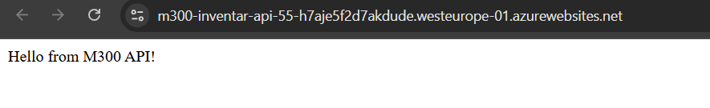

# Projektbericht

## Einleitung


Im Rahmen des Moduls 300 habe ich eine Inventar-API entwickelt, die in der Azure Cloud gehostet wird. Ziel des Projekts war es, die Abläufe von Cloud-Services praktisch zu verstehen und ein einfaches Backend bereitzustellen. Das Backend läuft in Azure und wird mit Monitoring-Tools überwacht.

Die API wurde mit Node.js 22 LTS entwickelt und ermöglicht das Abrufen sowie Hinzufügen von Geräten über HTTP-Endpunkte.

---

## Projektstruktur

Die Projektstruktur ist übersichtlich in folgende Ordner gegliedert:

```
Projekt/
├── backend/
│   ├── app.js
│   └── package.json
├── docs/
│   └── screenshots/
│       └── image.png
├── scripts/
│   ├── deploy.ps1
│   └── setup-monitoring.ps1
└── Readme.md
```

- **backend/**: Enthält den Quellcode der API.
- **docs/**: Dokumentation und Screenshots.
- **scripts/**: PowerShell-Skripte für Deployment und Monitoring.
- **Readme.md**: Übersicht und Einstieg ins Projekt.

---

## Funktionsübersicht

- **Backend API**: Läuft als Azure App Service (Linux, Node.js 22).
- **Endpoints**: `GET /devices`, `POST /devices`
- **Deployment**: Automatisiert via PowerShell-Skripte.
- **Monitoring**: Integration mit Application Insights.

---

## Schritt-für-Schritt-Anleitung

### 1. Node.js Backend entwickeln

Im Ordner `backend`:

**npm initialisieren**
```bash
npm init -y
```

**Express installieren**
```bash
npm install express
```

**Datei `app.js` erstellen**
```javascript
const express = require('express');
const app = express();
const port = process.env.PORT || 3000;

let devices = [];

app.use(express.json());

app.get('/devices', (req, res) => {
    res.json(devices);
});

app.post('/devices', (req, res) => {
    const device = req.body;
    devices.push(device);
    res.status(201).json({ message: 'Gerät hinzugefügt', device });
});

app.listen(port, () => {
    console.log(`Server läuft auf Port ${port}`);
});
```

---

### 2. Deployment auf Azure vorbereiten

Im Ordner `scripts`:

**`deploy.ps1` erstellen**
```powershell
$resourceGroup = "m300-projekt-rg"
$location = "westeurope"
$appServicePlan = "m300-app-plan"
$webApp = "m300-inventar-api"

Connect-AzAccount

New-AzResourceGroup -Name $resourceGroup -Location $location -ErrorAction SilentlyContinue
New-AzAppServicePlan -Name $appServicePlan -Location $location -ResourceGroupName $resourceGroup -Tier Free -ErrorAction SilentlyContinue
New-AzWebApp -Name $webApp -Location $location -AppServicePlan $appServicePlan -ResourceGroupName $resourceGroup -Runtime "NODE|22-lts" -ErrorAction SilentlyContinue
```

**Skript ausführen**
```powershell
.\deploy.ps1
```
Wenn du dan Via Azure deine Inventar API öffnest sollte du einen Link für folgende seite bekommen: 


---

### 3. Application Insights einrichten

**`setup-monitoring.ps1` erstellen**
```powershell
$resourceGroup = "m300-projekt-rg"
$webApp = "m300-inventar-api"
$appInsightsName = "m300-appinsights-noah"
$location = "westeurope"

$insights = New-AzApplicationInsights -ResourceGroupName $resourceGroup -Name $appInsightsName -Location $location -Kind web
Set-AzWebApp -ResourceGroupName $resourceGroup -Name $webApp -AppSettings @{ "APPINSIGHTS_INSTRUMENTATIONKEY" = $insights.InstrumentationKey }
```

**Skript ausführen**
```powershell
.\setup-monitoring.ps1
```
Ziel: 


### 4. Backend deployen

Mit **VS Code** und der **Azure App Service Extension**:

1. Rechtsklick auf die Web App im Azure-Explorer
2. „**Deploy to Web App**“ auswählen
3. Ordner `backend` auswählen
4. Azure lädt den Code automatisch hoch

Nun kannst du auch dies Kontrollieren oder anderst ausführen, falls es bei dir nicht funktioniert wie gewünscht. Gehe dazu auf die Kudu seite `https://m300-inventar-api-55-h7aje5f2d7akdude.scm.azurewebsites.net/dev/appsettings/settings` und ändere die Einstellungen. Beziehungsweise wenn deine API nicht aussieht wie auf Bild2 (Sieh bild2) Ist es eine möglichkeit es anderst zu versuchen.

Bild2:

---

### 5. API testen

**GET-Anfrage**
```http
GET https://m300-inventar-api.azurewebsites.net/devices
```

**POST-Anfrage**
```http
POST /devices
Content-Type: application/json

{
    "name": "Laptop Dell",
    "serialNumber": "ABC123",
    "user": "Max Muster"
}
```

Testen mit **Postman** oder **curl**.

### Extra Step. Inventar füllen

Unter `Backend/` befinden sich ein Python Skript welches 100 Geräte generiert und per POST an die API gesendet wird. Dieses script wird hier in der Command zeile ausgeführt. Script Name : `send_parallel_requests_updated.py`

---

### 6. Monitoring prüfen

Im **Azure-Portal** unter **Application Insights**:

- Fehler (500er)
- Live-Metriken
- Performance-Diagramme
- HTTP-Antwortstatus


---
### Darstellung der Daten

Nun ist unser Inventar mit den Devices,  verfügbar unter `https://m300-inventar-api-55-h7aje5f2d7akdude.westeurope-01.azurewebsites.net/devices` . Dies sieht recht unordentlich aus wesshalb ich mich dazu entscheiden habe die darstellung zu ändern. Im nächsten teil wird ein Streamlit Dashboard erstellt.


## 7. Streamlit-Dashboard integrieren

Um die Inventar-API benutzerfreundlich darzustellen und Monitoring-Daten visuell aufzubereiten, wurde ein interaktives Dashboard mit **Streamlit** entwickelt. Das Dashboard bietet eine Übersicht aller Geräte, ermöglicht das Hinzufügen neuer Einträge und zeigt Live-Metriken aus Azure Application Insights.

### Schritt 1 – Streamlit und Abhängigkeiten installieren

Installiere Streamlit und die benötigten Python-Bibliotheken:

```bash
pip install streamlit python-dotenv requests pandas matplotlib
```

### Schritt 2 – Projektstruktur erweitern

Lege im Projektverzeichnis einen neuen Ordner für das Dashboard an:

```
Projekt/
└── dashboard/
    └── app.py         # Streamlit-Hauptdatei
```

### Schritt 3 – Umgebungsvariablen konfigurieren

Erstelle eine `.env`-Datei im `dashboard/`-Verzeichnis mit den Zugangsdaten für Application Insights:

```
APPINSIGHTS_APP_ID=<deine-app-id>
APPINSIGHTS_API_KEY=<dein-api-key>
```

> Die Datei `.env` muss im selben Verzeichnis wie `app.py` liegen oder explizit geladen werden.

### Schritt 4 – Streamlit-Dashboard programmieren

Das Dashboard umfasst folgende Funktionen:

- **Geräteliste anzeigen:**  
  Die API wird per `requests.get()` abgefragt und die Geräte werden mit `st.dataframe()` dargestellt.

- **Gerät hinzufügen:**  
  Über ein Formular (`st.form`) können neue Geräte per `POST /devices` hinzugefügt werden. Nach erfolgreicher Eingabe aktualisiert sich das Dashboard automatisch.

- **Monitoring & Live-Metriken:**  
  Die Azure Application Insights REST API wird mit einer KQL-Abfrage angesprochen. Die Antwortzeiten der letzten Requests werden als Liniendiagramm mit `matplotlib` visualisiert.

**Beispiel für eine KQL-Abfrage:**
```kql
requests
| where success == true
| order by timestamp desc
| take 20
| project timestamp, duration
```

### Schritt 5 – Dashboard starten und testen

Starte das Dashboard mit:

```bash
cd Projekt/dashboard
streamlit run app.py
```

Das Dashboard öffnet sich automatisch im Browser unter [http://localhost:8501](http://localhost:8501).

### Ergebnisse & Tests

Das Streamlit-Dashboard bietet:

| Bereich        | Beschreibung                                 |
| -------------- | -------------------------------------------- |
| Geräteliste    | Dynamisch geladen über `GET /devices`        |
| Hinzufügen     | Formular für neue Geräte (`POST /devices`)   |
| Monitoring     | Live-Metriken aus Application Insights       |
| Infos          | Projekthintergrund und Tech-Stack            |


### Funktionalität

Liste ladet:

Hinzufügen funktioniert :

Monitoring ist Live : 


---

## Fazit

Mit dieser Schritt-für-Schritt-Anleitung kann das Projekt einfach nachgebaut, erweitert und in Azure betrieben werden. Die klare Ordnerstruktur und Automatisierungsskripte erleichtern Wartung und Weiterentwicklung.


