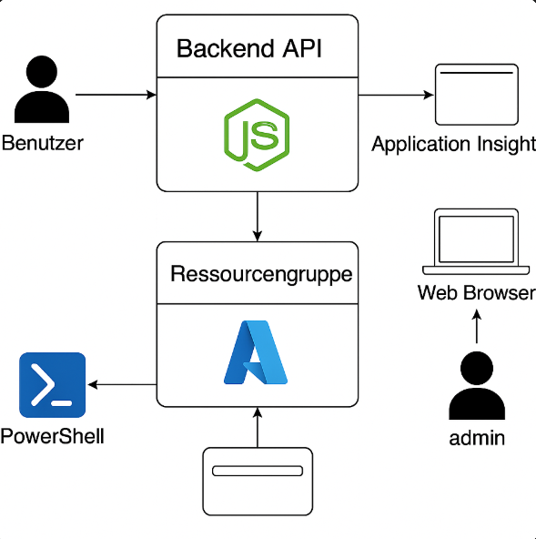

# Projektbericht

## Einleitung



Bei dem Modul 300 habe ich eine Inventar-API entwickelt, die in der Azure Cloud gehostet wird. Mein Ziel bei diesem Projekt war es des vertieften ablauf von Cloud-Services zu verstehen und dazu ein einfaches Backend aufzubauen. Das Backend wird in Azure bereitgestellt und mit Monitoring-Tools überwacht.

Die API wurde mit Node 22 TLS implementiert und ermöglicht das Abrufen und Hinzufügen von Geräten über HTTP-Endpoints.

## Dokumentation

#### Vorbereitung

Mein erster schritt war es eine VS Code Hirarchie zu bauen. In Meinem Projekt befinden sich die folgenden Ordner:

- Projekt
  - backend
    - app.js
    - package.json
  - docs
    - screenshots
      - image.png
  - scripts
    - deploy.ps1
    - setup-monitoring.ps1
  - Readme.md


#### Was die Dateien tun

Die Backend API läuft in Azure App Service.
Es bietet Endpunkte für GET POST /Devices 


Azure App Servuce Hostet meine API in einer Linux Umgebung mit Node 22. Stack

Die Powershell Skripte werden mir dabei helfen bei der Erstellung von Ressourcen. 

Unteranderem Sind die Powershell skripte auch dazu da um alles zu Monitoren unter Application Insights. 

## Anleitung:


# Schritt 1 – Node.js Backend entwickeln

Im Ordner `backend`:

## npm initialisieren

```bash
npm init -y
```

## Express installieren

```bash
npm install express
```

## Datei `app.js` erstellen

```javascript
const express = require('express');
const app = express();
const port = process.env.PORT || 3000;

let devices = [];

app.use(express.json());

app.get('/devices', (req, res) => {
  res.json(devices);
});

app.post('/devices', (req, res) => {
  const device = req.body;
  devices.push(device);
  res.status(201).json({ message: 'Gerät hinzugefügt', device });
});

app.listen(port, () => {
  console.log(`Server läuft auf Port ${port}`);
});
```

---

# Schritt 3 – Azure-Deployment vorbereiten

Erstelle die Datei `scripts/deploy.ps1` mit folgendem Inhalt:

```powershell
$resourceGroup = "m300-projekt-rg"
$location = "westeurope"
$appServicePlan = "m300-app-plan"
$webApp = "m300-inventar-api"

Connect-AzAccount

New-AzResourceGroup -Name $resourceGroup -Location $location -ErrorAction SilentlyContinue
New-AzAppServicePlan -Name $appServicePlan -Location $location -ResourceGroupName $resourceGroup -Tier Free -ErrorAction SilentlyContinue
New-AzWebApp -Name $webApp -Location $location -AppServicePlan $appServicePlan -ResourceGroupName $resourceGroup -Runtime "NODE|18-lts" -ErrorAction SilentlyContinue
```

## Ausführen über PowerShell:

```powershell
.\deploy.ps1
```

---

# Schritt 4 – Application Insights verknüpfen

Erstelle die Datei `setup-monitoring.ps1` mit folgendem Inhalt:

```powershell
$resourceGroup = "m300-projekt-rg"
$webApp = "m300-inventar-api"
$appInsightsName = "m300-appinsights-noah"

$insights = New-AzApplicationInsights -ResourceGroupName $resourceGroup -Name $appInsightsName -Location $location -Kind web
Set-AzWebApp -ResourceGroupName $resourceGroup -Name $webApp -AppSettings @{ "APPINSIGHTS_INSTRUMENTATIONKEY" = $insights.InstrumentationKey }
```

## Ausführen über PowerShell:

```powershell
.\setup-monitoring.ps1
```

---

# Schritt 5 – Backend deployen

Ich habe **VS Code** und die **Azure App Service Extension** verwendet:

- Rechtsklick auf Web App (im Azure-Explorer)
- „**Deploy to Web App**“
- Ordner `backend` auswählen
- Azure lädt den Code automatisch hoch

---

# Schritt 6 – API testen

## GET-Anfrage:

```http
https://m300-inventar-api.azurewebsites.net/devices
```

## POST-Anfrage:

```http
POST /devices
Content-Type: application/json

{
  "name": "Laptop Dell",
  "serialNumber": "ABC123",
  "user": "Max Muster"
}
```

Ich habe **Postman** verwendet und getestet, ob Geräte korrekt gespeichert und zurückgegeben werden.

---

# Schritt 7 – Monitoring prüfen

Im **Azure-Portal** unter **Application Insights**:

- Fehler (500er)
- Live-Metriken
- Performance-Diagramme
- HTTP-Antwortstatus prüfen
- Optional: Warnungen mit **Action Groups** per E-Mail senden
